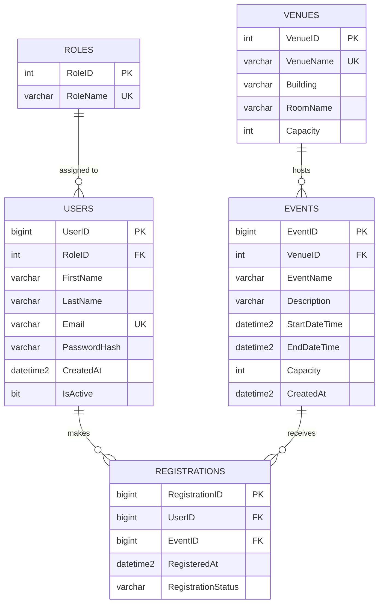

# SUBMISSION: Online Campus Event Management System

Group Hands-On Laboratory Examination, Applied Generative AI for IT Solution Development

## Team Roster

| Member | Name | Assigned Role | Core Responsibilities |
|---|---|---|---|
| Member 1 | Jereign B. Lim | Systems Architect & Prompt Lead | Task 1 (Requirements & Prompt Engineering), Task 5 (Documentation & Integration) |
| Member 2 | Bianca Lauryn H. Magno | Frontend Engineer | Task 2 (AI-Assisted UI & WCAG Accessibility) |
| Member 3 | Gracy Mae C. Luna | Database & Backend Engineer | Task 3 (3NF Schema, Mermaid.js ERD, SQL Scripts) |
| Member 4 | Ian Charles Padolina | QA & Security Engineer | Task 4 (Unit Testing & Vulnerability Refactoring) |

- **Date:** 09/30/2026
- **Subject:** IT Professional Elective Lab
- **Repository:** https://github.com/lim-jereign/ITPEMidtermExam

---

## Task 1: Requirements Analysis & Prompt Architecture

### 1.1 Exact Prompt (RCTC Framework)

**AI tool used:** Claude (Anthropic)

```text
ROLE
You are a Lead Systems Architect with 15 years of experience designing web
applications for universities. You specialize in delivering realistic,
time-boxed prototypes and you are known for rejecting over-engineered designs.

CONTEXT
A team of 4 fourth-year BSIT students (beginners in generative AI tools) has
exactly 3 hours to build a working prototype of an Online Campus Event
Management System. The system must let:
  1. Students view upcoming campus events,
  2. Students register for an event,
  3. Administrators view the list of registered attendees for an event.
The repository will contain: /frontend (HTML/CSS/JS), /backend (C# service
code), /database (SQL Server schema.sql), and unit tests. Roles are split as:
frontend engineer, database engineer, QA/security engineer, and architect.

TASK
Produce an overall system design for this prototype. Include:
  a) A short list of functional and non-functional requirements
  b) A high-level architecture (layers and how they communicate)
  c) The recommended tech stack with a one-line justification for each choice
  d) The main entities and their relationships (names only, no full DDL)
  e) The key API endpoints (method, route, purpose)
  f) A suggested work breakdown that lets 4 people work in parallel without
     blocking each other, with time estimates that fit inside 3 hours

CONSTRAINTS
  - Do NOT use third-party state management libraries such as Redux.
  - Do NOT propose microservices, message queues, Docker orchestration, or
    cloud-specific services (no Azure/AWS dependencies).
  - Do NOT use a JavaScript frontend framework that requires a build step;
    use plain HTML5, CSS, and vanilla JavaScript.
  - The frontend must use semantic HTML5 and follow WCAG (POUR) principles.
  - The backend must be C# and the database must be SQL Server, 3NF.
  - All database access must use parameterized queries.
  - Keep the entire design under 700 words and format it with headings and
    tables where helpful.
  - If any requirement cannot realistically fit in 3 hours, say so and
    explicitly mark it as "out of scope".
```

### 1.2 AI Output (recorded verbatim from Claude)

## System Design: Campus Event Management Prototype

### a) Requirements

**Functional**
- FR1: Students can list upcoming events (title, date, venue, seats left).
- FR2: Students can register for an event using name and campus email.
- FR3: Registration is rejected if the event is full, the email is not a campus email, or the student is already registered.
- FR4: Admins can view all registered attendees for a selected event.

**Non-functional**
- NFR1: Semantic HTML5 and WCAG (POUR) compliance.
- NFR2: All SQL is parameterized; connections are disposed properly.
- NFR3: Validation logic is unit-testable in isolation using mocks.

**Out of scope (3-hour limit):** real authentication/login, email confirmations, payment, event creation UI, cancellation flow. Admin access is simulated with a simple admin page or a hard-coded admin key.

### b) Architecture

A simple 3-layer design.

| Layer | Responsibility | Talks to |
|---|---|---|
| Presentation (`/frontend`) | Static HTML/CSS/JS, `fetch()` calls | REST API (JSON) |
| Application (`/backend`) | ASP.NET Core minimal API, `RegistrationService`, validation | Data access via `IRegistrationRepository` |
| Data (`/database`) | SQL Server, 3NF schema | Accessed only through parameterized ADO.NET |

Validation and seat checks live in the service layer behind interfaces so the QA engineer can mock the repository.

### c) Tech Stack

| Choice | Justification |
|---|---|
| HTML5 + CSS + vanilla JS | No build step; plays well with AI UI generators; easy semantic/WCAG control |
| ASP.NET Core minimal API (C#) | Matches the required `RegistrationService.cs`; very little boilerplate |
| SQL Server + ADO.NET (`Microsoft.Data.SqlClient`) | Meets 3NF/DDL requirement; parameterized queries are explicit |
| xUnit + Moq | Standard C# unit testing with mock objects |
| State: plain JS variables/DOM | No Redux or state library needed at this size |

### d) Entities

- **Users** (UserId, FullName, Email, Role)
- **Events** (EventId, Title, Description, Venue, EventDate, Capacity)
- **Registrations** (RegistrationId, UserId, EventId, RegisteredAt)

Relationships: one User to many Registrations; one Event to many Registrations. Unique constraint on (UserId, EventId).

### e) API Endpoints

| Method | Route | Purpose |
|---|---|---|
| GET | `/api/events` | List upcoming events with seats remaining |
| GET | `/api/events/{id}` | Event details |
| POST | `/api/registrations` | Register a student for an event |
| GET | `/api/admin/events/{id}/attendees` | List attendees (admin) |

### f) Work Breakdown (180 minutes)

| Member | Work | Time | Depends on |
|---|---|---|---|
| M1 Architect | RCTC prompt, design, API contract, docs | 30 min, then 15 min integration | None |
| M2 Frontend | Event catalog and registration form using mocked JSON first | 45 min | API contract from M1 |
| M3 Database | 3NF schema, ERD, `schema.sql` with FKs, CHECKs, indexes | 45 min | Entity list from M1 |
| M4 QA/Security | Mock-based unit tests, fix SQL injection and resource leak | 45 min | Interface names from M1 |

Parallel work is possible because M1 publishes the entity list, endpoints, and interface names in the first 10 minutes.

### 1.3 Manual Grounding Evaluation

The AI-generated architecture is realistic for a 3-hour prototype because it avoids frameworks with build steps, avoids microservices and cloud dependencies, and explicitly marks login, email, and payment as out of scope. The three-entity model (Users, Events, Registrations) and four API endpoints are small enough for four people to finish in parallel within their 45-minute task windows. One risk is that the 45-minute estimates leave little slack for integrating the frontend with the live API, so the team should build the frontend against mocked JSON first and connect it during the 15-minute integration window. Overall the design is achievable, provided the team resists adding authentication or event-creation screens.

---

## Task 2: AI-Assisted Frontend Development

**Responsible:** Bianca Lauryn H. Magno (Member 2)

**AI tool used:** Copilot and Claude AI

**Exact prompts:**

**Prompt 2.1: Generate the HTML skeleton (Semantic HTML5 + WCAG)**

```text
ROLE: You are a senior frontend engineer specializing in accessible web design.

CONTEXT: I am building a prototype for an "Online Campus Event Management System" for a university (email domain @univ.edu.ph). Students view upcoming events and register. Administrators view registered attendees. This is a 3-hour exam prototype using only HTML, CSS, and vanilla JavaScript.

TASK: Write the complete index.html for a single-page interface with these parts:
1. <header> with the site title "CampusConnect", a logo, and a <nav> with anchor links: Events, Register, Admin.
2. <main> containing:
   a. A hero <section> with a heading, short tagline, and a call-to-action link to the events.
   b. An "Upcoming Events" <section> containing a grid of 6 <article> cards. Each card has an image with meaningful alt text, category, title, date/time (using <time datetime="">), venue, seats remaining, and a "Register" button.
   c. A "Register for an Event" <section> with a form: Full Name, Student ID, University Email, Event (select dropdown), Year Level (select), and a checkbox for accessibility/special needs assistance, plus a submit button.
   d. An "Administrator: Registered Attendees" <section> with an accessible <table> (with <caption>, <thead>, <th scope="col">) and an event filter dropdown.
3. <footer> with contact info and copyright.

CONSTRAINTS:
- Use Semantic HTML5 tags (<header>, <nav>, <main>, <section>, <article>, <footer>). Do NOT use generic <div> wrappers where a semantic tag fits.
- Every input must have BOTH a proper <label for="..."> AND an aria-label attribute.
- Every  must have descriptive alt text.
- Add a "Skip to main content" link at the top.
- Use aria-live="polite" for a form status message area.
- Link to styles.css and script.js. Do NOT use any CSS framework, jQuery, or external libraries.
- Use placeholder image paths like images/event-1.svg through images/event-6.svg.
- Output only the code.
```

**Prompt 2.2: Generate the CSS (custom color palette, formal design)**

```text
ROLE: You are a senior UI/UX designer and CSS expert.

CONTEXT: Attached is index.html for a formal, professional university event management site.

TASK: Write the complete styles.css. Use exactly this color palette as CSS custom properties in :root:
--navy-900: #010736;
--navy-800: #0D1C42;
--navy-600: #22396F;
--cream-100: #FCF1D0;
--gold-200: #F8E0A4;

DESIGN DIRECTION: Formal, elegant, modern academic look. Deep navy header, hero, and footer with cream and gold text. Cream page background with white-ish cards, navy headings, and gold accents/buttons. Use a serif font (Georgia or 'Playfair Display' fallback) for headings and a clean sans-serif system font stack for body text. Include subtle box shadows, rounded corners (8-12px), and smooth hover transitions on cards and buttons.

CONSTRAINTS:
- Text/background color combinations must meet WCAG AA contrast (4.5:1). Use navy text on cream/gold backgrounds and cream/gold text on navy backgrounds. Never put #22396F text on #0D1C42.
- Include a visible :focus-visible outline (gold or navy, 3px) on all links, buttons, and form fields.
- Layout: CSS Grid for the event cards (auto-fill, minmax 280px), Flexbox for the header/nav.
- Fully responsive: mobile (<600px), tablet, desktop. The admin table must scroll horizontally on small screens.
- Style form validation states (.error, .success) using text AND icons/borders, not color alone.
- Respect prefers-reduced-motion.
- Do NOT use any framework or external CSS library.
- Output only the code.
```

**Prompt 2.3: JavaScript for events, form validation, and admin view**

```text
ROLE: You are a senior JavaScript developer focused on accessible, secure front-end code.

CONTEXT: Attached are index.html and styles.css. This is a prototype with no backend yet, so use mock data in memory.

TASK: Write script.js in vanilla JavaScript that:
1. Defines an array of 6 mock campus events (id, title, category, date, venue, capacity, registered count).
2. Renders event cards into the Upcoming Events section from that array, showing seats remaining. If seats = 0, show "Fully Booked" and disable the button.
3. Clicking "Register" on a card scrolls to the form and pre-selects that event in the dropdown.
4. Populates the event <select> elements from the array.
5. Validates the registration form on submit:
   - Full name: required, letters/spaces only
   - Student ID: required, format like 2023-00123
   - Email: required and MUST end with @univ.edu.ph
   - Event: required, must have seats available
   Show inline error messages linked to the fields using aria-describedby and set aria-invalid="true" on invalid fields.
6. On success, add the registration to an in-memory array, reduce seats remaining, update the cards, and announce success in the aria-live status region.
7. Renders the admin attendee table and filters it by event.

CONSTRAINTS:
- Use textContent instead of innerHTML for user-provided data (prevent XSS).
- Do NOT use any third-party libraries or frameworks.
- Use const/let, no var. Add short comments.
- Output only the code.
```

**Prompt 2.4: Accessibility audit**

```text
ROLE: You are a WCAG 2.1 AA accessibility auditor.

TASK: Review the attached index.html, styles.css, and script.js against the POUR principles (Perceivable, Operable, Understandable, Robust). List every issue you find: missing labels or aria-label attributes, missing alt text, poor color contrast, heading-order problems, missing focus styles, keyboard traps, and non-semantic tags. For each issue, give the file, the line, and the fix.

CONSTRAINTS: Do not rewrite the whole files. Only list issues and show the corrected snippets.
```

**Prompt 2.5: Final polish**

```text
Improve the visual polish of the attached files without breaking accessibility or the color palette: add a subtle gold divider under section headings, a "Featured" badge on one event card, and a stats strip in the hero (e.g., "24 Events", "1,200+ Students", "12 Organizations"). Keep all semantic tags, labels, and aria attributes intact. Output only the changed snippets.
```

**Code location:**
- Repository: https://github.com/lim-jereign/ITPEMidtermExam
- Branch: `feature/frontend` (merged into `main`)
- Folder: `/frontend`
  - `index.html` (page structure)
  - `styles.css` (styling, palette, responsive layout)
  - `script.js` (event rendering, validation, admin table)
  - `images/` (`event-1.png` to `event-4.png`)

**Semantic HTML5 tags used:**
`<header>`, `<nav>`, `<main>`, `<section>`, `<article>`, `<footer>`, `<form>`, `<fieldset>`, `<legend>`, `<label>`, `<time datetime>`, `<table>` with `<caption>`, `<thead>`, `<tbody>` and `<th scope="col">`, plus `<ul>`/`<li>` for the navigation and event lists. Each event card is an `<article>`, and each page part is a `<section>` with an `aria-labelledby` heading.

**WCAG (POUR) features implemented:**

*Perceivable*
- Descriptive alt text on every event image
- Text/background pairs use navy on cream/gold or cream/gold on navy, chosen for AA contrast
- Errors use an icon, an "Error:" text prefix and a border, not color alone

*Operable*
- "Skip to main content" link
- All controls are native links, buttons and inputs, so the page works by keyboard alone
- Visible 3px `:focus-visible` outline on links, buttons and fields
- `prefers-reduced-motion` respected

*Understandable*
- Every input has a `<label for>` and an `aria-label`
- Inline validation messages linked with `aria-describedby`, and `aria-invalid` on bad fields
- Help text under the email field (@dlsud.edu.ph)
- `lang="en"` on the page

*Robust*
- Valid semantic markup, table with caption and header scopes
- `aria-live="polite"` status region announces success and errors
- User input is inserted with `textContent`, not `innerHTML` (prevents XSS)

**Manual corrections made to AI output:**
1. Submit button used gold on a cream background (weak contrast, hard to see). Created a `.button-submit` style with cream text on navy.
2. Form fields were misaligned because the email help text made rows uneven. Rebuilt the form as a symmetrical 2x2 grid with `align-items: start`, and moved the "Your details" title inside the card.
3. AI generated 6 events, which left an uneven grid. Reduced the catalog to 4 events and set an explicit 4/2/1 column layout.
4. AI used a generic @univ.edu.ph domain. Changed the pattern, JS regex, error message and help text to @dlsud.edu.ph.
5. AI form fields (Full Name, Student ID, Year Level) did not match the database. Refactored the form, mock data and admin table to match the Users, Events, Venues and Registrations tables and their constraints.

---

## Task 3: Database Design & ERD Generation

**Responsible:** Gracy Mae C. Luna (Member 3)

**AI tool used:** ChatGPT

**Exact prompt:**

```text
You are a Senior Database Engineer. Design a Third Normal Form (3NF) relational schema for an Online Campus Event Management System where students view upcoming events, register for events, and admins view registered attendees. Include at least these entities: Users, Events, Registrations (add others like Venues or Roles if justified). Output: (1) a short explanation of why it's 3NF, (2) an Entity-Relationship Diagram in Mermaid.js erDiagram syntax, (3) a production-grade SQL Server (T-SQL) DDL script. In the script, explicitly include: primary keys, foreign keys with ON DELETE rules, CHECK constraints (e.g. capacity > 0, end time after start time, valid email format, valid role), UNIQUE constraints (e.g. one registration per user per event), and NONCLUSTERED indexes on every foreign key column. Do not use SELECT * or unnamed constraints.
```

**ERD (Mermaid.js):**



**DDL script location:** `/database/schema.sql`

**Included in the script:**
- Primary keys (clustered) on all 5 tables
- Named foreign keys with `ON DELETE NO ACTION`
- CHECK constraints: capacity > 0, EndDateTime > StartDateTime, email format, valid role (Student/Admin), valid registration status (Registered/Cancelled), non-empty names
- UNIQUE constraints: Email, RoleName, VenueName, and (UserID, EventID) in Registrations
- Non-clustered indexes on every FK column: `IX_Users_RoleID`, `IX_Events_VenueID`, `IX_Registrations_UserID`, `IX_Registrations_EventID`
- Extra index `IX_Events_StartDateTime` for upcoming-event queries
- Default values for CreatedAt, IsActive, RegisteredAt, RegistrationStatus

**3NF justification:**
Each table represents one entity or relationship, and every column holds a single value. Non-key columns depend on the whole primary key and nothing else. Venue details live in Venues instead of being repeated in Events, and role names live in Roles instead of being repeated in Users. Registrations holds only data about the user-event relationship and resolves the many-to-many link between Users and Events.

**Manual corrections made to AI output:**
1. Changed `ON DELETE CASCADE` to `ON DELETE NO ACTION` on both Registrations foreign keys, because cascading would erase registration history and contradict the AI's own audit claim. Cancellations are tracked through RegistrationStatus.
2. Wrapped `CREATE DATABASE` in `IF DB_ID('CampusEventManagement') IS NULL` so the script does not fail when the database already exists.
3. The AI gave only a rendered ERD image, so the Mermaid.js code was written manually to match the schema.
4. The AI did not enforce that event capacity cannot exceed venue capacity. A CHECK constraint cannot compare across tables, so this is documented as an application-level or trigger check.

---

## Task 4: Shift-Left Testing, Security & Refactoring

**Responsible:** Ian Charles Padolina (Member 4)

### Part A: Unit Tests

**AI tool used:** Copilot

**Exact prompt:**

```text
write xUnit tests with Moq for email domain validation and seat availability
```

**Validation routine tested:** `RegistrationValidator.IsValidStudentEmail` (domain @univ.edu.ph, case-insensitive, rejects empty/null values and spoofed domains such as juan@univ.edu.ph.evil.com) and `HasAvailableSeat`.

**Mock objects used:** `Mock<IEventRepository>` (Moq) for `GetCapacity` and `GetRegisteredCount`, so no real database is needed.

**Test results:** `dotnet test` (xUnit, .NET 8): Passed! - Failed: 0, Passed: 10, Skipped: 0, Total: 10, Duration: 25 ms

### Part B: Security & Vulnerability Refactoring

**AI tool used:** Claude

**Exact prompt for diagnosis:**

```text
Role: You are a Senior Application Security Engineer specializing in C# and SQL Server.

Context: Tech stack is C#, ADO.NET (SqlConnection), SQL Server. This method is part of an Online Campus Event Management System. Relevant schema:

CREATE TABLE dbo.Users (UserID BIGINT IDENTITY PRIMARY KEY, RoleID INT NOT NULL, FirstName VARCHAR(100), LastName VARCHAR(100), Email VARCHAR(255) NOT NULL UNIQUE, PasswordHash VARCHAR(255), ...);

CREATE TABLE dbo.Registrations (RegistrationID BIGINT IDENTITY PRIMARY KEY, UserID BIGINT NOT NULL REFERENCES dbo.Users(UserID), EventID BIGINT NOT NULL REFERENCES dbo.Events(EventID), RegisteredAt DATETIME2(0), RegistrationStatus VARCHAR(20));

Code to review:

public string GetUserRegistration(string inputEmail) {
  string connStr = "Server=myServerAddress;Database=myDataBase;User Id=myUsername;Password=myPassword;";
  SqlConnection conn = new SqlConnection(connStr);
  conn.Open();
  SqlCommand cmd = new SqlCommand("SELECT * FROM Registrations WHERE Email = '" + inputEmail + "'", conn);
  return cmd.ExecuteScalar().ToString();
}

Task: Diagnose this code for SQL injection risks and unmanaged resource (memory) leaks. Explain each issue, how it could be exploited or fail, and its severity. Also flag any other problems, including mismatches between the query and the schema. Do NOT rewrite the code yet.

Constraints: Output as a numbered list of findings, each with: Issue, Why it is dangerous, Severity (High/Medium/Low). Keep it under 300 words. Do not invent columns that are not in the schema.
```

**AI diagnosis:**

1. **SQL Injection**
   - Why it is dangerous: `inputEmail` is concatenated directly into the SQL string. An input like `' OR '1'='1` returns other users' data, and `'; DROP TABLE ...--` can modify or destroy data.
   - Severity: High
2. **Unmanaged resource leak**
   - Why it is dangerous: `SqlConnection` and `SqlCommand` are never closed or disposed. Connections stay checked out of the pool until garbage collection, so repeated calls can exhaust the pool and make the app hang or fail.
   - Severity: High
3. **Query does not match the schema**
   - Why it is dangerous: `Email` is a column of `dbo.Users`, not `dbo.Registrations`. The query throws "Invalid column name 'Email'" at runtime. Registrations must be joined to Users through `UserID`.
   - Severity: High
4. **Hardcoded credentials**
   - Why it is dangerous: The connection string with username and password is in source code, so anyone with repository access can read it, and changing it requires a redeploy.
   - Severity: High
5. **`SELECT *` with `ExecuteScalar`**
   - Why it is dangerous: `ExecuteScalar` returns only the first column of the first row, so most of the data is discarded. A user can have many registrations (uniqueness is on UserID + EventID), so a single-value return is misleading.
   - Severity: Medium
6. **Unhandled null result**
   - Why it is dangerous: If no row matches, `ExecuteScalar()` returns null and `.ToString()` throws `NullReferenceException`.
   - Severity: Medium
7. **No input validation or error handling**
   - Why it is dangerous: Null or empty emails are passed straight to the database, and SQL exceptions may leak internal details to callers.
   - Severity: Low

**Refactored code location:** `/backend/RegistrationService.cs`

**Fixes applied:**
1. Parameterized query using `SqlParameter` (`SqlDbType.VarChar`, 255) against SQL injection.
2. `using` statements for `SqlConnection`, `SqlCommand` and `SqlDataReader` against resource leaks.
3. Removed the hardcoded connection string; it is now passed in through the constructor.
4. Removed `SELECT *`; the query lists explicit columns.
5. Added a JOIN to Users, because the Email column is there.

**Manual corrections made to AI output:**
1. Changed the return type to `List<RegistrationRecord>`, because one user can have many registrations.
2. Mapped all columns to `RegistrationRecord` using `SqlDataReader`.
3. Added the `RegistrationRecord` class.

---

## Task 5: Group Integration & Verification Report

**Responsible:** Jereign B. Lim (Member 1), with input from all members

### Setup Instructions

1. Clone the repository: `git clone https://github.com/lim-jereign/ITPEMidtermExam.git` and `cd ITPEMidtermExam`.
2. **Frontend:** open `/frontend/index.html` in a browser (or use the VS Code Live Server extension).
3. **Database:** open SQL Server Management Studio, create a database, and run `/database/schema.sql`.
4. **Backend:** open `/backend` in Visual Studio or VS Code, set the connection string, then run `dotnet run`.
5. **Tests:** from the tests folder, run `dotnet test`.

(Adjust the steps to match what the team actually built.)

### AI Disclosure Statement

The following AI tools were used during this examination:

| Tool | Used by | Purpose |
|---|---|---|
| Claude (Anthropic) | Jereign B. Lim (Member 1) | System design from the RCTC prompt (Task 1) and report drafting |
| Copilot and Claude AI | Bianca Lauryn H. Magno (Member 2) | HTML, CSS and JavaScript generation, accessibility audit and visual polish (Task 2) |
| ChatGPT | Gracy Mae C. Luna (Member 3) | Schema and DDL generation, Git/GitHub troubleshooting, reviewing the AI-generated SQL for flaws, and drafting the Mermaid.js ERD code (Task 3) |
| Copilot and Claude | Ian Charles Padolina (Member 4) | Unit test generation (Copilot) and security diagnosis and refactoring (Claude) (Task 4) |

**How outputs were verified:**
(describe how each member checked the AI output)

**How outputs were verified:**

Each member reviewed the AI output for their own task before committing it to the repository.

- **Task 1 (Jereign):** The AI-generated architecture was checked against the exam requirements and the 3-hour time limit. After the database design was finalized, the API contract and field names were updated to match it.
- **Task 2 (Bianca):** The generated HTML, CSS and JavaScript were reviewed against the POUR principles, including an AI accessibility audit (Prompt 2.4), and then corrected by hand. The corrections covered button contrast, form layout, the email domain, and aligning the form and admin table with the database tables.
- **Task 3 (Gracy):** The AI-generated SQL script was reviewed for flaws. The foreign key delete rules were changed to protect registration history, the database creation statement was made safe to re-run, and the Mermaid.js ERD was written by hand to match the schema.
- **Task 4 (Ian):** The generated unit tests were run with `dotnet test` (10 of 10 passed). The AI diagnosis of the flawed method was reviewed, and the refactored code was corrected by hand so it returns all of a user's registrations.

### Group Verification Log

| Task # | Identified AI Flaw / Limitation | Manual Correction Applied | Member Responsible |
|---|---|---|---|
| 1 | The AI design listed only 3 tables and simple fields (FullName, Venue, Title), which was too basic for a production schema | Gracy added Roles and Venues tables and split names into FirstName and LastName. I then updated the API contract and field names to match the final schema | Jereign B. Lim |
| 2 | Submit button used gold on a cream background, giving weak contrast | Created a .button-submit style with cream text on navy | Bianca Lauryn H. Magno |
| 2 | AI used a generic @univ.edu.ph email domain | Changed the pattern, JS regex, error message and help text to @dlsud.edu.ph | Bianca Lauryn H. Magno |
| 2 | AI form fields (Full Name, Student ID, Year Level) did not match the database | Refactored the form, mock data and admin table to match the Users, Events, Venues and Registrations tables | Bianca Lauryn H. Magno |
| 3 | AI used ON DELETE CASCADE on Registrations foreign keys, which would erase registration history | Changed to ON DELETE NO ACTION and track cancellations through RegistrationStatus | Gracy Mae C. Luna |
| 3 | AI did not enforce event capacity not exceeding venue capacity | Documented as an application-level or trigger check, since a CHECK constraint cannot compare across tables | Gracy Mae C. Luna |
| 4 | The refactored method's return type did not fit the data, since one user can have many registrations | Changed the return type to List<RegistrationRecord>, mapped all columns with SqlDataReader and added the RegistrationRecord class | Ian Charles Padolina |

