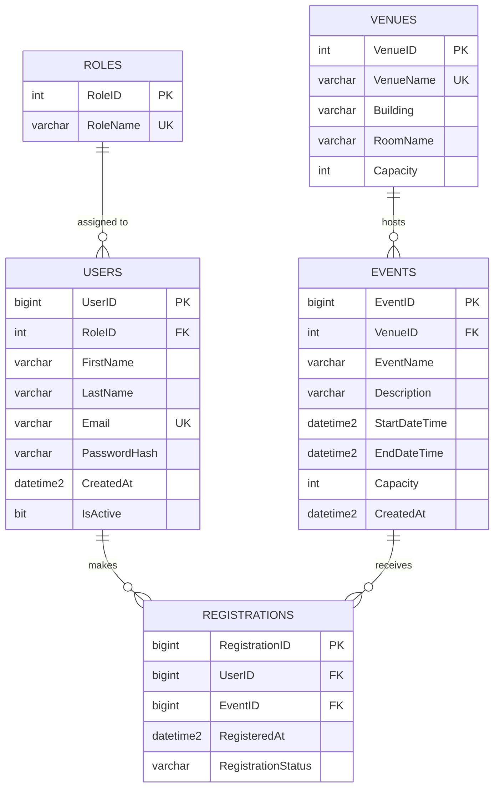

## Task 3

### Prompt used
   You are a Senior Database Engineer. Design a Third Normal Form (3NF) relational schema for an Online Campus Event Management System where students view upcoming events, register for events, and admins view registered attendees. Include at least these entities: Users, Events, Registrations (add others like Venues or Roles if justified). Output: (1) a short explanation of why it's 3NF, (2) an Entity-Relationship Diagram in Mermaid.js erDiagram syntax, (3) a production-grade SQL Server (T-SQL) DDL script. In the script, explicitly include: primary keys, foreign keys with ON DELETE rules, CHECK constraints (e.g. capacity > 0, end time after start time, valid email format, valid role), UNIQUE constraints (e.g. one registration per user per event), and NONCLUSTERED indexes on every foreign key column. Do not use SELECT * or unnamed constraints.

### AI explanation of 3NF
The schema is in Third Normal Form (3NF) because each table represents one main entity or relationship, and each column contains a single, atomic value. Non-key attributes depend on the whole primary key and not on only part of it. There are no unnecessary transitive dependencies. Venue details are stored in Venues rather than repeated in Events, and roles are separated from users through Roles. Registrations contains only attributes specific to the relationship between a user and an event.

### ERD (Mermaid.js)


### Database script
See `/database/schema.sql`.


---

## Task 4

### Part A: Unit Tests

| Field | Details |
|---|---|
| AI tool used | Claude (Anthropic) |
| Exact prompt | `write xUnit tests with Moq for email domain validation and seat availability` |
| Validation routine tested | `RegistrationValidator.IsValidStudentEmail` (only `@univ.edu.ph`, case-insensitive, rejects empty/null and spoofed domains like `juan@univ.edu.ph.evil.com`) and `RegistrationValidator.HasAvailableSeat` |
| Mock objects used | `Mock<IEventRepository>` (Moq) for `GetCapacity` and `GetRegisteredCount`, so no real database is used |
| Test results | `dotnet test` (xUnit, .NET 8): Passed! - Failed: 0, Passed: 10, Skipped: 0, Total: 10, Duration: 25 ms |

Files: `/backend/RegistrationValidator.cs`, `/backend/RegistrationValidatorTests.cs`

### Part B: Security & Vulnerability Refactoring

| Field | Details |
|---|---|
| AI tool used | Claude (Anthropic) |
| Refactored code location | `/backend/RegistrationService.cs` |

#### Exact prompt for diagnosis

```
Role: You are a Senior Application Security Engineer specializing in C# and SQL Server.

Context: Tech stack is C#, ADO.NET (SqlConnection), SQL Server. This method is part of an
Online Campus Event Management System. Relevant schema:

CREATE TABLE dbo.Users (
    UserID BIGINT IDENTITY PRIMARY KEY, RoleID INT NOT NULL,
    FirstName VARCHAR(100), LastName VARCHAR(100),
    Email VARCHAR(255) NOT NULL UNIQUE, PasswordHash VARCHAR(255), ...);

CREATE TABLE dbo.Registrations (
    RegistrationID BIGINT IDENTITY PRIMARY KEY,
    UserID BIGINT NOT NULL REFERENCES dbo.Users(UserID),
    EventID BIGINT NOT NULL REFERENCES dbo.Events(EventID),
    RegisteredAt DATETIME2(0), RegistrationStatus VARCHAR(20));

Code to review:

public string GetUserRegistration(string inputEmail) {
    string connStr = "Server=myServerAddress;Database=myDataBase;User Id=myUsername;Password=myPassword;";
    SqlConnection conn = new SqlConnection(connStr);
    conn.Open();
    SqlCommand cmd = new SqlCommand("SELECT * FROM Registrations WHERE Email = '" + inputEmail + "'", conn);
    return cmd.ExecuteScalar().ToString();
}

Task: Diagnose this code for SQL injection risks and unmanaged resource (memory) leaks.
Explain each issue, how it could be exploited or fail, and its severity. Also flag any other
problems, including mismatches between the query and the schema. Do NOT rewrite the code yet.

Constraints: Output as a numbered list of findings, each with: Issue, Why it is dangerous,
Severity (High/Medium/Low). Keep it under 300 words. Do not invent columns that are not in the schema.
```

#### AI diagnosis

```
1. SQL Injection
   - Why it is dangerous: `inputEmail` is concatenated directly into the SQL string. An input like `' OR '1'='1` returns other users' data, and `'; DROP TABLE ...--` can modify or destroy data.
   - Severity: High

2. Unmanaged resource leak
   - Why it is dangerous: `SqlConnection` and `SqlCommand` are never closed or disposed. Connections stay checked out of the pool until garbage collection, so repeated calls can exhaust the pool and make the app hang or fail.
   - Severity: High

3. Query does not match the schema
   - Why it is dangerous: `Email` is a column of `dbo.Users`, not `dbo.Registrations`. The query throws "Invalid column name 'Email'" at runtime. Registrations must be joined to Users through `UserID`.
   - Severity: High

4. Hardcoded credentials
   - Why it is dangerous: The connection string with username and password is in source code, so anyone with repository access can read it, and changing it requires a redeploy.
   - Severity: High

5. `SELECT *` with `ExecuteScalar`
   - Why it is dangerous: `ExecuteScalar` returns only the first column of the first row, so most of the data is discarded. A user can have many registrations (uniqueness is on UserID + EventID), so a single-value return is misleading.
   - Severity: Medium

6. Unhandled null result
   - Why it is dangerous: If no row matches, `ExecuteScalar()` returns null and `.ToString()` throws `NullReferenceException`.
   - Severity: Medium

7. No input validation or error handling
   - Why it is dangerous: Null or empty emails are passed straight to the database, and SQL exceptions may leak internal details to callers.
   - Severity: Low
```

#### Refactor prompt

```
Role: You are a Senior C# Backend Engineer.

Context: (same schema and flawed method as in the diagnosis prompt above)

Task: Refactor the method into a class RegistrationService in RegistrationService.cs.
Fix every issue you identified.

Constraints:
- Use parameterized queries (SqlParameter with explicit SqlDbType and size).
- Use `using` statements for SqlConnection and SqlCommand.
- Query must JOIN dbo.Users and dbo.Registrations because Email lives in Users.
- Do not hardcode the connection string; inject it via the constructor.
- No SELECT *. Handle the no-result case without throwing.
- Use Microsoft.Data.SqlClient. No third-party libraries.
```

#### Fixes applied

1. **SQL injection:** replaced string concatenation with a parameterized query (`SqlParameter`, `SqlDbType.VarChar`, size 255).
2. **Resource leak:** added `using` statements for `SqlConnection`, `SqlCommand`, and `SqlDataReader`.
3. **Hardcoded credentials:** removed the connection string from the method; it is now injected through the constructor.
4. **`SELECT *`:** replaced with an explicit column list.
5. **Schema mismatch:** added `INNER JOIN dbo.Users` because `Email` lives in `Users`.

#### Manual corrections made to AI output

1. Changed the return type from a single `string` (`ExecuteScalar`) to `List<RegistrationRecord>`, since one user can have many registrations.
2. Replaced `ExecuteScalar` with `SqlDataReader` and mapped all columns into a new `RegistrationRecord` class.
3. _(add anything else you actually changed, or delete this line)_
