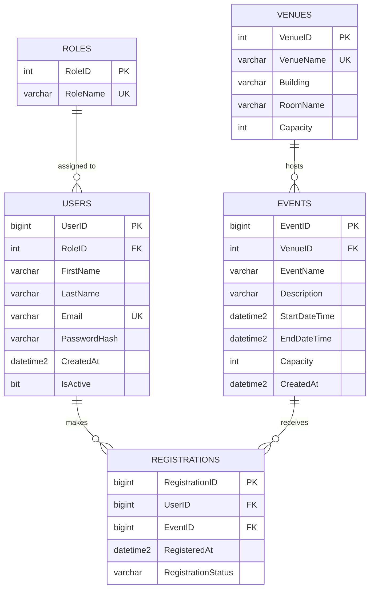

## Task 3

### Prompt used
(paste your exact prompt here)

### AI explanation of 3NF
(paste the AI's "Why this is in 3NF" section here)

### ERD (Mermaid.js)

### Database script
See `/database/schema.sql`.