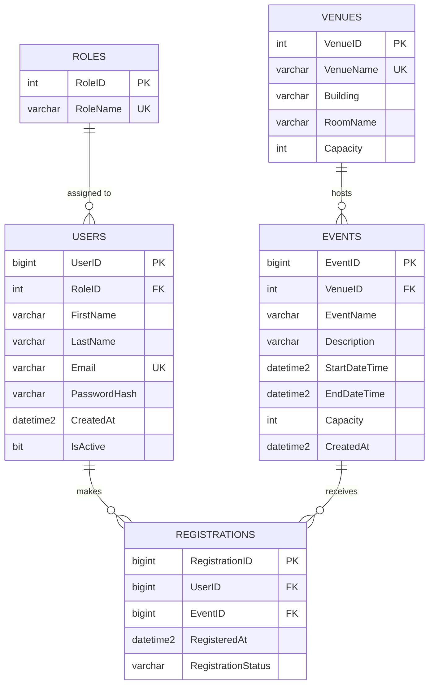

## Task 3

### Prompt used
   You are a Senior Database Engineer. Design a Third Normal Form (3NF) relational schema for an Online Campus Event Management System where students view upcoming events, register for events, and admins view registered attendees. Include at least these entities: Users, Events, Registrations (add others like Venues or Roles if justified). Output: (1) a short explanation of why it's 3NF, (2) an Entity-Relationship Diagram in Mermaid.js erDiagram syntax, (3) a production-grade SQL Server (T-SQL) DDL script. In the script, explicitly include: primary keys, foreign keys with ON DELETE rules, CHECK constraints (e.g. capacity > 0, end time after start time, valid email format, valid role), UNIQUE constraints (e.g. one registration per user per event), and NONCLUSTERED indexes on every foreign key column. Do not use SELECT * or unnamed constraints.

### AI explanation of 3NF
The schema is in Third Normal Form (3NF) because each table represents one main entity or relationship, and each column contains a single, atomic value. Non-key attributes depend on the whole primary key and not on only part of it. There are no unnecessary transitive dependencies. Venue details are stored in Venues rather than repeated in Events, and roles are separated from users through Roles. Registrations contains only attributes specific to the relationship between a user and an event.

### ERD (Mermaid.js)

### Database script
See `/database/schema.sql`.
